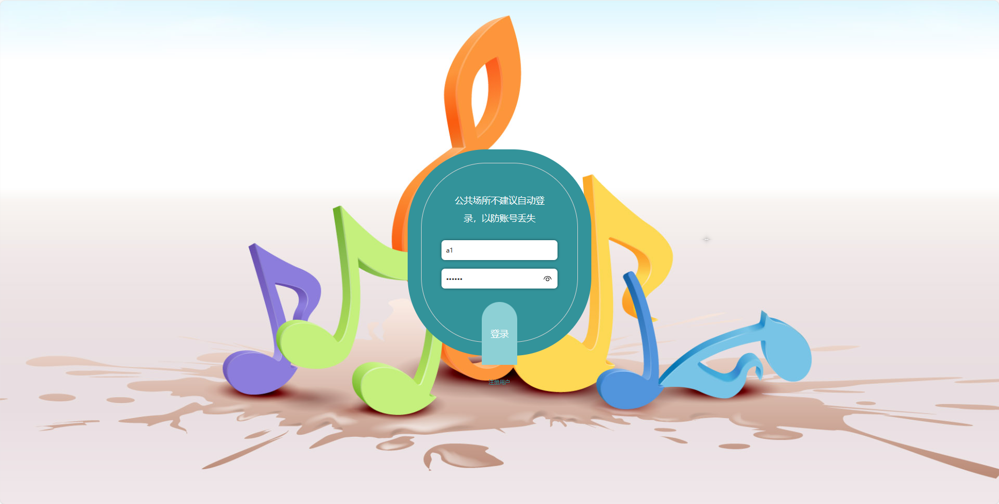
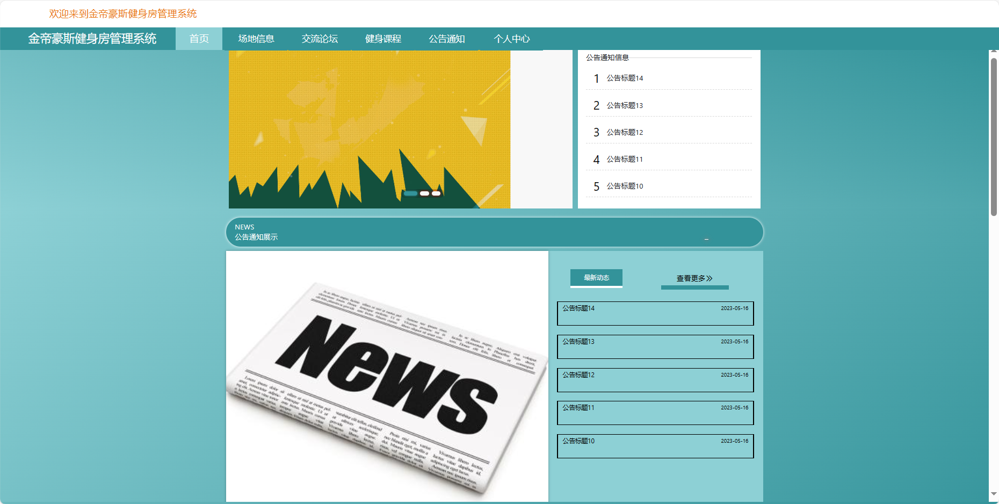
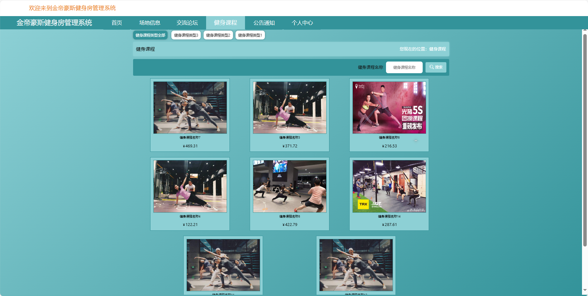
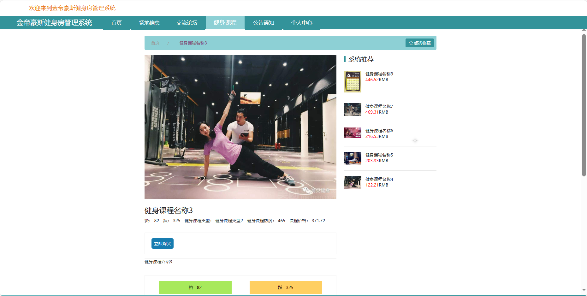
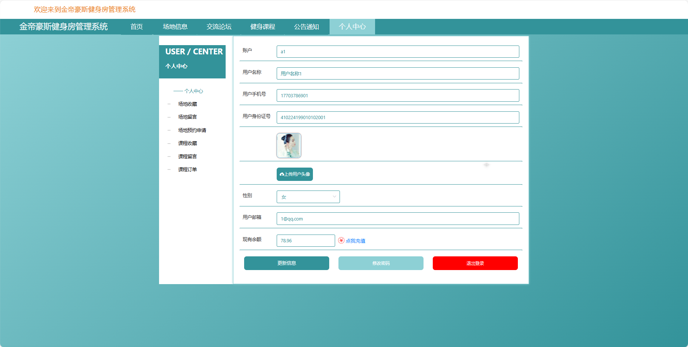
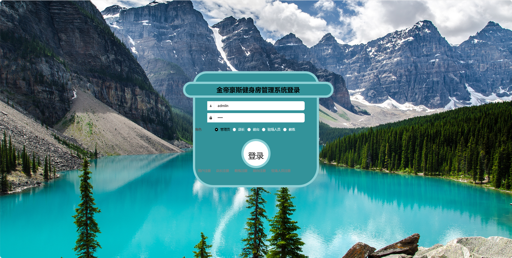

基于Springboot的金帝豪斯健身房管理系统
=
### 完整代码获取地址：从戎源码网 ([https://armycodes.com/](https://armycodes.com/))
### 作者微信：19941326836  QQ：952045282 
### 承接计算机毕业设计、Java毕业设计、Python毕业设计、深度学习、机器学习
### 选题+开题报告+任务书+程序定制+安装调试+论文+答辩ppt 一条龙服务
### 所有选题地址https://github.com/nature924/allProject

一、项目介绍
---
基于Spring Boot框架实现的金帝豪斯健身房管理系统，系统包含六种角色：管理员、用户,教练，前台，驻场人员，店长主要功能如下。

### 【用户功能】

1. **首页：** 用户登录后的系统主页。
2. **场地信息：** 查看健身房场地的信息。
3. **交流论坛：** 学员可以在这里进行互动和交流。
4. **健身课程：** 查看、搜索并预约健身课程。
5. **公告通知：** 查看健身房发布的通知和公告。
6. **个人中心：** 用户个人信息的管理中心等。

### 【管理员功能】

1. **首页：** 显示系统的整体概况。
2. **个人中心：**
   - **修改密码：** 修改管理员账户的登录密码。
   - **个人信息：** 查看和编辑管理员的基本信息。
3. **管理员管理：** 管理系统中的管理员账户。
4. **店长管理：** 管理健身房的店长信息。
5. **教练管理：** 对教练账户进行管理。
6. **前台管理：** 对前台工作人员账户进行管理。
7. **驻场人员管理：** 对驻场人员账户进行管理。
8. **用户管理：** 对学员账户进行管理。
9. **健身课程管理：** 管理健身课程。
   - **课程留言管理：** 查看和管理课程的留言评论。
   - **课程收藏管理：** 管理用户对课程的收藏。
   - **课程订单管理：** 查看学员预约的课程订单情况。
10. **场地信息管理：** 管理健身房的场地信息，场地的添加、编辑和删除。
   - **场地留言管理：** 查看和管理场地的留言评论。
   - **场地收藏管理：** 管理用户对场地的收藏。
   - **场地预约申请管理：** 查看用户提交的场地预约申请。
11. **健身器材管理：** 管理健身房的器材信息，器材的添加、编辑和删除。
12. **出入库管理：** 管理器材的出入库情况，记录和详情管理。
13. **资费管理：** 管理用户的会员资费。
14. **基础数据管理：**
    - **场地类型管理：** 维护健身房场地的分类。
    - **健身课程类型管理：** 管理健身课程的分类。
    - **健身器材类型管理：** 管理健身器材的分类。
    - **公告类型管理：** 维护通知公告的分类。
    - **资费类型管理：** 维护会员资费的分类。
15. **交流论坛管理：** 管理健身房的交流平台。
16. **公告通知管理：** 发布和管理通知公告。
17. **轮播图信息：** 管理系统首页的轮播图信息。

### 【教练功能】

1. **首页：** 显示信息。
2. **个人中心：**
   - **修改密码：** 修改个人账户的登录密码。
   - **个人信息：** 查看和编辑个人基本信息。
3. **课程订单管理：** 查看学员预约的健身课程订单情况。

### 【前台功能】

1. **首页：** 显示信息。
2. **个人中心：**
   - **修改密码：** 修改个人账户的登录密码。
   - **个人信息：** 查看和编辑个人基本信息。
3. **用户管理：** 对学员账户进行管理。
4. **资费管理：** 管理用户的会员资费。
5. **交流论坛管理

：** 管理健身房的交流平台，包括发帖管理等。
6. **公告通知管理：** 发布和管理通知公告。

### 【驻场人员功能】

1. **首页：** 显示信息。
2. **个人中心：**
   - **修改密码：** 修改个人账户的登录密码。
   - **个人信息：** 查看和编辑个人基本信息。
3. **健身器材管理：** 管理健身房的器材信息，器材的添加、编辑和删除。
4. **出入库管理：** 管理器材的出入库情况，记录和详情管理。

### 【店长功能】

1. **首页：** 显示信息。
2. **个人中心：**
   - **修改密码：** 修改个人账户的登录密码。
   - **个人信息：** 查看和编辑个人基本信息。
3. **店长管理：** 管理健身房的店长信息
4. **教练管理：** 对教练账户进行管理。
5. **前台管理：** 对前台工作人员账户进行管理。
6. **驻场人员管理：** 对驻场人员账户进行管理。
7. **健身课程管理：** 管理健身课程课程的添加、编辑和删除。
   - **课程留言管理：** 查看和管理课程的留言评论。
   - **课程收藏管理：** 管理用户对课程的收藏。
   - **课程订单管理：** 查看学员预约的课程订单情况。
8. **场地信息管理：** 管理健身房的场地信息，包括场地的添加、编辑和删除。
   - **场地留言管理：** 查看和管理场地的留言评论。
   - **场地收藏管理：** 管理用户对场地的收藏。
   - **场地预约申请管理：** 查看用户提交的场地预约申请。
9. **健身器材管理：** 管理健身房的器材信息，器材的添加、编辑和删除。
10. **出入库管理：** 管理器材的出入库情况。
11. **交流论坛管理：** 管理健身房的交流平台。
12. **公告通知管理：** 发布和管理通知公告。

二、项目技术
---
- 编程语言：Java
- 数据库：MySQL
- 项目管理工具：Maven
- 前端技术：VUE、HTML、Jquery、Bootstrap
- 后端技术：Spring、SpringMVC、MyBatis

三、运行环境
---
- 操作系统：Windows、macOS都可以
- JDK版本：JDK1.8以上都可以
- 开发工具：IDEA、Ecplise、Myecplise都可以
- 数据库: MySQL5.7以上都可以
- Tomcat：任意版本都可以
- Maven：任意版本都可以

四、运行截图
---

### 程序截图：

